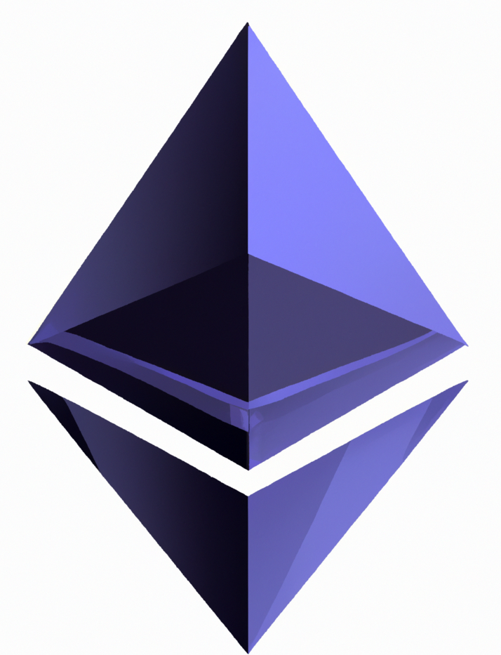

<div align="center">
  
</div>

<div align="center">
  <h1>NestedVM </h1>
</div>

<br>

**NestedVM is an Ethereum Virtual Machine (EVM) Hypervisor written in [Huff](https://huff.sh/), allowing the execution of arbitrary EVM Bytecode.**

```solidity
function execute() public returns (uint256 result) {
    // Bytecode for “3 + 4" and return the result
    (bool success, bytes memory data) = NestedVM.delegatecall(hex”600360040160005260ff6000f3");
    result = abi.decode(data, (uint256));
}
```

***

## What is an hypervisor?

According to [vmware](https://www.vmware.com/topics/glossary/content/hypervisor.html)...

> A hypervisor, also known as a virtual machine monitor or VMM, is software that creates and runs virtual machines (VMs). A hypervisor allows one host computer to support multiple guest VMs by virtually sharing its resources, such as memory and processing.

In our case, the NestedVM allows to run an **EVM on top the EVM** and execute [opcodes](https://www.evm.codes/) directly.

## How it works?

### Calling the NestedVM

The NestedVM ingests raw bytecode (as input) via `call` or `delegateCall`, then processes the opcodes and executes them.

<div align="center">
  
</div>

### Bytecode processing

A pointer reads an opcode from the bytecode (extracted from calldata), translates it into a NestedVM opcode implementation (more details below), executes and moves on to the next opcode.
The pointer is stored in memory and updated each time it moves.

<div align="center">
  
</div>

Each opcode is re-implemented to fit the NestedVM memory layout and logic.

<div align="center">
  
</div>

### Memory Layout

When running a smart contract, you have the whole memory available (from 0x00 to infinity).
However, the NestedVM needs some memory for its internals.
This memory is taken from the 0x00 offset. Every opcode call that accesses memory (ran by the host) will be fixed to skip this reserved memory.

The NestedVM private memory layout is as follows:

- `[0x00-0x20]` 👉 Execution pointer
- `[0x20-0x220]` 👉 Jump table
- `[0x220-0x340]` 👉 Memory reserved for debug purposes (see debug-utils.huff)
- `[0x220-0x460]` **(when contract contract verifier is enabled)** 👉 Memory used to store contract verification call args & result. nb: It overlaps debug memory (because we dont need them both at the same time)

Thus, the actual memory of the host is starting at either 0x340 or 0x460 depending on the chosen configuration.

## Why?

Using the NestedVM gives a maximum of flexibility, it replaces using specific scripts to interact with external protocols.  
There is no limit on which interactions that can be created.
Custom and complex logic with chained calls can be executed by the NestedVM opening a lot possibilities.   
Repetive intructions and common ones could also be called as helper contract if needed.

## Example of use

One way to use the NestedVM is to use it as a library called with delegatecall.
As shown below, a [Contract Wallet](https://docs.ethhub.io/using-ethereum/wallets/smart-contract-wallets/) allows to execute a delegatecall (or several), and thus to call the NVM. The DApp managing the contract wallet gives the bytecode for the NVM to execute. For example :
* Swap multiple assets.
* Approve & deposit.

<div align="center">
  
</div>

## Gas consumption

TODO: Gives incations on gas consumption (doubleSwap example)

## Addresses

TODO: NestedVM addresses (when deployed)
## Getting Started

TODO: Gives more details to run the project.

You will need:
* [Huff](https://docs.huff.sh/get-started/installing/)
* [Foundry/Forge](https://github.com/foundry-rs/foundry)

You can find `easm`, the basic EVM assemby compiler that is used to compile tests [here](https://github.com/oguimbal/EVM-Assembler)  
You can use [pyevmasm](https://github.com/crytic/pyevmasm) to disassemble bytecode 
