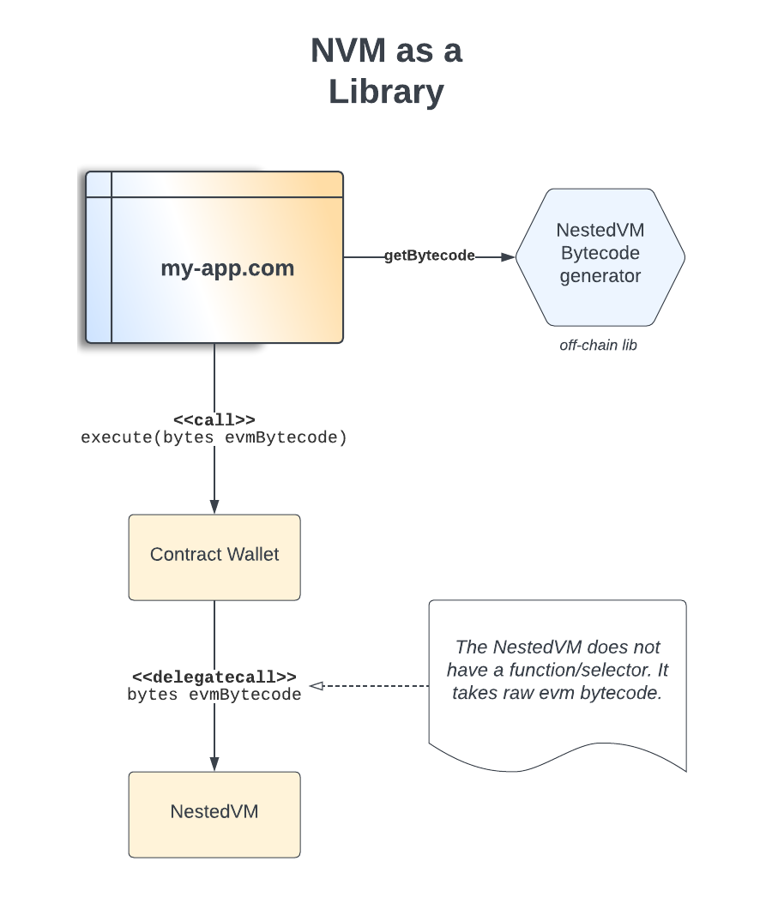
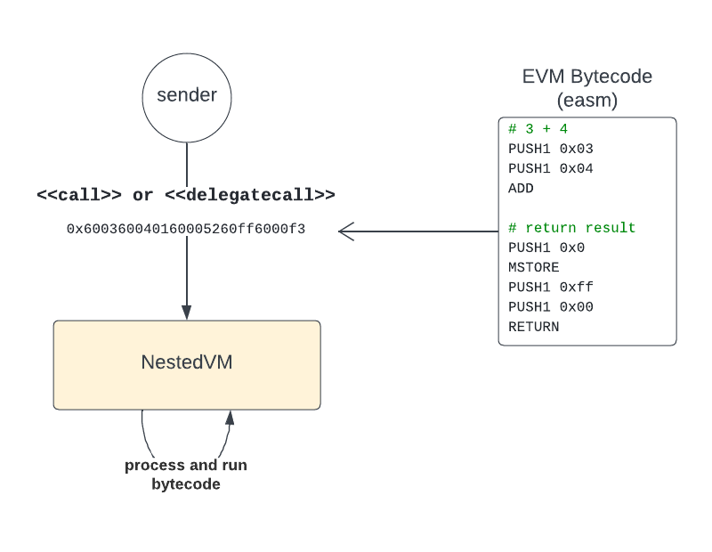
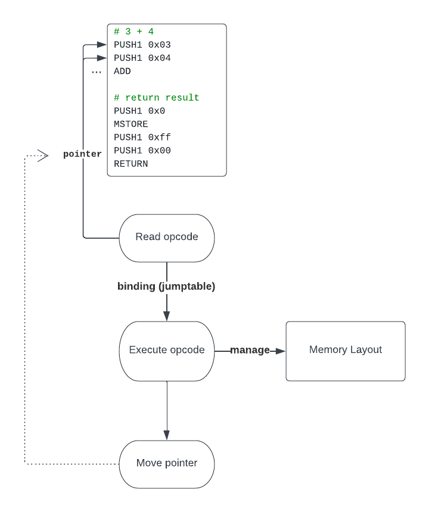

<div align="center">
  <h1>HyVM</h1>
  
  <span style="margin: 10px;">&nbsp;&nbsp;&nbsp;&nbsp;✕&nbsp;&nbsp;&nbsp;&nbsp;</span>
  
</div>

<div align="center">
  <h3>...the execution core of <a href="https://nested.fi">nested.fi</a></h3>
  <br>
  HyVM is an Ethereum Virtual Machine (EVM) Hypervisor written in <a href="https://huff.sh/">Huff</a>, allowing the execution of arbitrary EVM Bytecode.
  <br>
  <br>
  <h3> 👉 See it in action with <a href="https://hyvm.nested.fi/">HyVM live playground</a></h3>
</div>

<br>


```solidity
function execute() public returns (uint256 result) {
    // Bytecode for “3 + 4" and return the result
    (bool success, bytes memory data) = HyVM.delegatecall(hex”600360040160005260ff6000f3");
    result = abi.decode(data, (uint256));
}
```

***

## What is a hypervisor?

According to [vmware](https://www.vmware.com/topics/glossary/content/hypervisor.html)

> A hypervisor, also known as a virtual machine monitor or VMM, is software that creates and runs virtual machines (VMs). A hypervisor allows one host computer to support multiple guest VMs by virtually sharing its resources, such as memory and processing.

In our case, the HyVM allows to run an **EVM on top the EVM** and execute [opcodes](https://www.evm.codes/) directly.

## Why?

Using the HyVM gives a maximum of flexibility, it replaces using specific scripts to interact with external protocols.
There is no limit on which interactions that can be created.
Custom and complex logic with chained calls can be executed by the HyVM opening a lot possibilities.
Repetitive intructions and common ones could also be called as helper contract if needed.

## How to use the HyVM

The way to use the HyVM is to use it as a library called with delegatecall.
As shown below, a [contract wallet](https://decommas.io/blog/smart-contract-wallets-explained) allows to execute a delegatecall (or several), and thus to call the HyVM. The DApp managing the contract wallet gives the bytecode for the HyVM to execute. For example:
* Swap multiple assets.
* Approve & deposit.

<div align="center">
  
</div>

## How it works?

### Calling the HyVM

The HyVM ingests raw bytecode (as input) via `delegateCall`, then processes the opcodes and executes them.

<div align="center">
  
</div>

### Bytecode processing

A pointer reads an opcode from the bytecode (extracted from calldata), translates it into a HyVM opcode implementation (more details below), executes and moves on to the next opcode.
The pointer is stored in memory and updated each time it moves.

<div align="center">
  
</div>

Each opcode is re-implemented to fit the HyVM memory layout and logic.

<div align="center">
  
</div>

### Memory Layout

When running a smart contract, you have the whole memory available (from 0x00 to infinity).
However, the HyVM needs some memory for its internals.
This memory is taken from the 0x00 offset. Every opcode call that accesses memory (ran by the host) will be fixed to skip this reserved memory.

The HyVM private memory layout is as follows:

- `[0x00-0x20]` 👉 Execution pointer
- `[0x20-0x220]` 👉 Jump table
- `[0x220-0x340]` 👉 Memory reserved for debug purposes (see debug-utils.huff)
- `[0x220-0x460]` **(when contract contract verifier is enabled)** 👉 Memory used to store contract verification call args & result. nb: It overlaps debug memory (because we dont need them both at the same time)

Thus, the actual memory of the host is starting at either 0x340 or 0x460 depending on the chosen configuration.

## Disclaimer on jumpdest validity

⚠️ The HyVM skips `jumpdest` (0x5B) validations that might appear in `push` opcodes values. This is OK if the executed bytecode is well formed (for instance, if you compiled it using `solc` or equivalent). But if you feed broken bytecode to the HyVM, this could lead to some discrepancies between the HyVM and the actual EVM behaviour.  
There is an open issue to implement the validation if needed [here](https://github.com/oguimbal/HyVM/issues/16).

## HyVM / EVM divergence

The HyVM consistently behaves as if the executed code did not receive any calldata.  
The calldata in the delegatecall to the HyVM is the code to be executed.  
Consequently, there are some opcodes divergence:
- `calldataload`: pushes 0 on stack
- `calldatasize`: pushes 0 on stack
- `calldatacopy`: copies zeros in the specified location
- `selfdestruct`: reverts to prevent malicious or erroneous selfdestruct
- `jumpdest`: as mentioned in the disclaimer, there is no check to ensure the validity of the opcode.
- `codesize`: returns the calldatasize, not the VM size
- `callcode` will revert : it is deprecated and generally considered unsafe.


## Addresses

Deployed at `0xCB70efa43300Cd9B7eF4ed2087ceA7f7f6f3c195` on:

- [Ethereum](https://etherscan.io/address/0xCB70efa43300Cd9B7eF4ed2087ceA7f7f6f3c195#code)
- [Polygon](https://polygonscan.com/address/0xCB70efa43300Cd9B7eF4ed2087ceA7f7f6f3c195#code)
- [BNB Chain](https://bscscan.com/address/0xCB70efa43300Cd9B7eF4ed2087ceA7f7f6f3c195#code)
- [Arbitrum](https://arbiscan.io/address/0xCB70efa43300Cd9B7eF4ed2087ceA7f7f6f3c195#code)
- [Avalanche](https://snowtrace.io/address/0xCB70efa43300Cd9B7eF4ed2087ceA7f7f6f3c195#code)
- [Optimism](https://optimistic.etherscan.io/address/0xCB70efa43300Cd9B7eF4ed2087ceA7f7f6f3c195#code)
- [Fantom](https://ftmscan.com/address/0xCB70efa43300Cd9B7eF4ed2087ceA7f7f6f3c195#code)
- [Aurora](https://aurorascan.dev/address/0xCB70efa43300Cd9B7eF4ed2087ceA7f7f6f3c195#code)
- [Goerli](https://goerli.etherscan.io/address/0xCB70efa43300Cd9B7eF4ed2087ceA7f7f6f3c195#code)
- [Sepolia](https://sepolia.etherscan.io/address/0xCB70efa43300Cd9B7eF4ed2087ceA7f7f6f3c195#code)

## Getting Started

You will need:
* [Huff](https://docs.huff.sh/get-started/installing/) (`huffc 0.3.1` / `nightly-94c34e402a46365fee29863aa08558af178c2b94`)  
This is the last version with which the HyVM was tested.
It is not possible to pin the Huffc version in CI consistently as pre-released versions are pruned and only the 3 newest nightlies are kept. So it is not pinned in CI.
* [Foundry/Forge](https://github.com/foundry-rs/foundry)

You can find `easm`, the basic EVM assembly compiler that is used to compile tests [here](https://github.com/oguimbal/EVM-Assembler).  
You can use [pyevmasm](https://github.com/crytic/pyevmasm) to disassemble bytecode.


### How to deploy

Example of how to deploy to Polygon:

```bash
forge script --private-key XXXXXXXXXXXXX --chain-id 137 --rpc-url https://polygon-rpc.com --froms 0x945f803f01F443616546d1F31466c0E7ACfF36f7 --sender 0x945f803f01F443616546d1F31466c0E7ACfF36f7 script/Deploy.s.sol --broadcast --gas-price 40000000000 --gas-limit 9632030 --legacy
```